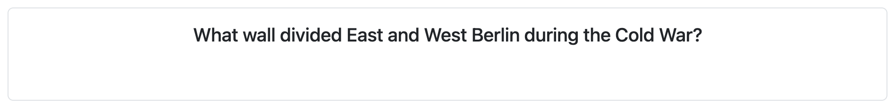
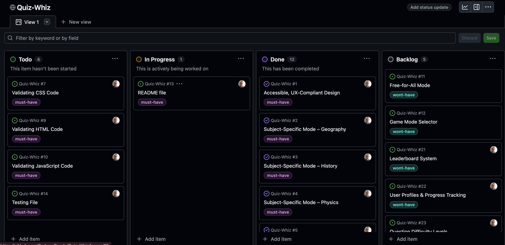

# [Quiz-Whiz](https://radwanduadu.github.io/Quiz-Whiz)

Developer: Radwan Duadu ([RadwanDuadu](https://www.github.com/RadwanDuadu))

The Pop Quiz Game Website is an interactive, educational web application designed to engage users in a fun and intuitive quiz experience across a range of core academic subjects, including Geography, History, Biology, Chemistry, and Physics. Built using HTML, CSS, and JavaScript, the site incorporates modern front-end practices with a strong focus on accessibility, responsiveness, and user experience design.

The goal of this project is to create an enjoyable and informative platform that caters to students, lifelong learners, and trivia enthusiasts who want to test or improve their knowledge through quick and interactive gameplay. With various game modes available — such as subject-specific quizzes, free-for-all mixed subject rounds, and customizable game rules — users can tailor their learning experience to suit their preferences or study goals.

In addition to its educational utility, the platform is designed with modern web development principles: clean, validated code; semantic HTML5 structure; mobile-first responsive layout; and visually engaging, feedback-rich interaction using modals and animated transitions.

**Site Mockups**

source: [Quiz-Whiz amiresponsive](https://ui.dev/amiresponsive?url=https://radwanduadu.github.io/Quiz-Whiz)

## UX

### The 5 Planes of UX

#### 1. Strategy

**Purpose**
- Provide users with an engaging and accessible platform to test and expand their knowledge in core subjects like Geography, History, Biology, Chemistry, and Physics.
- Deliver instant, meaningful feedback via interactive visuals (e.g., modals and color cues) to enhance understanding and user experience.
- Promote accessibility through responsive design, semantic HTML, and compliance with WCAG standards to ensure the quiz is usable by all audiences.
- Support multiple game modes to accommodate different learning styles — from casual free-for-all trivia to focused subject-specific quizzes.

**Primary User Needs**
- Challenge their knowledge across different academic domains in a fun, fast-paced quiz format.
- Receive immediate, clear feedback on submitted answers to support learning and retention.
- Navigate easily across subjects and game modes with intuitive UI controls and accessible layouts.
- Stay motivated through dynamic question pools, responsive interactions, and visual encouragement (e.g., score tracking or feedback modals).

**Business Goals**
- Foster continued user engagement through customizable quiz experiences suited to both casual users and academic learners.
- Showcase a modern, responsive, and accessible web application that exemplifies front-end development best practices — ideal for inclusion in portfolios or as a demonstrable teaching resource.
- Provide a scalable and maintainable project structure suitable for future expansion (e.g., leaderboard integration, user accounts, or timed challenges).

#### 2. Scope

**[Features](#features)** (see below)

**Content Requirements**

- Game controls and options must have clear labels and instructions for ease of use.
- Modals should provide friendly and informative feedback for errors and answer results.
- Answers should be validated instantly with immediate visual feedback.
- User performance stats (correct/incorrect answers) should be visibly tracked during gameplay.
- A custom error page must be available to handle invalid routes or broken links gracefully.

#### 3. Structure

**Information Architecture**

- **Game Rules**:
  - Simple section highlighting all rules.
- **Hierarchy**:
  - The Game Area is the main focus, prominently displaying the selected game mode and current subject.
  - The Question Area is placed centrally, clearly showing the active question and multiple-choice options.
  - The Control Panel (within the Game Area) allows users to select subjects, switch game modes, and start/reset quizzes.
  - A Results & Feedback Section visibly displays the user's score, answer feedback, and overall progress.
  - Any error messages (e.g., no answer selected) are shown via modals with consistent styling and clear context.

**User Flow**

1. User lands on the Home Page → has the option to click the Game Rules button to read instructions and understand how the game works.
2. Without any interaction, the game automatically starts with Geography questions displayed in the Question Area.
3. If the user prefers a different subject, they can select an alternative subject before answering the first question.
4. User selects one of the four multiple-choice answers and clicks the Submit button (keyboard input is not supported).
5. A Bootstrap modal appears to show whether the selected answer was correct or incorrect.
6. User then chooses to either continue to the next question, select another subject, or reset the game entirely.
7. The flow continues with repeated question-answer-feedback cycles based on the selected mode or subject.

#### 4. Skeleton

**[Wireframes](#wireframes)** (see below)

#### 5. Surface

**Visual Design Elements**

- **[Colours](#colour-scheme)** (see below)
- **[Typography](#typography)** (see below)

### Colour Scheme

The Quiz-Whiz project uses a light and playful color palette to promote an engaging and educational atmosphere. The combination of Bootstrap's default light theme with carefully selected highlight colors ensures clarity, accessibility, and a modern design feel.

Bright and contrasting hues are used to indicate interactivity (like selected answers and topics), while background and text colors maintain a clean and user-friendly interface. The use of color reinforces correct user flow and feedback, especially in question prompts, score tracking, and modals.

- `#f8f9fa` (Solitude): Main page background (bg-light) for a bright, clean look.
- `#ffffff` (White): Question and answer containers (bg-white) for readability and contrast.
- `#007bff` (Bootstrap Blue): Highlight color for selected answers and buttons (interactive elements).
- `#0056b3` (Deep Blue): Border color for selected answers to enhance visual clarity.
- `#dc3545` (Bootstrap Red): Used for the Reset Button, signaling a strong action.
- `#198754` (Bootstrap Green): Used for the Submit Button, indicating confirmation/approval.
- `#000000` (Black): Employed for selected topic borders and key text elements for strong contrast.
- `#212529` (Charcoal): Modal headers and other text-heavy areas for improved readability.
- `#0d6efd` (Primary Blue): Bootstrap modal controls and action buttons, ensuring consistent UI behavior.

### Typography

The typography design of Quiz-Whiz aims for simplicity and accessibility, relying on well-supported system fonts to maintain performance while ensuring text is readable, clear, and easy to navigate across all devices and screen sizes.

- [Bootstrap Default Fonts](https://getbootstrap.com/docs/5.3/content/typography/) are used throughout the project to ensure broad browser compatibility and quick loading. This includes `-apple-system, BlinkMacSystemFont, "Segoe UI", Roboto, "Helvetica Neue", Arial, sans-serif`.
- [Font Awesome](https://fontawesome.com) icons were used throughout the site, such as the social media icons in the footer.

## Wireframes

To follow best practice, wireframes were developed for mobile, tablet, and desktop sizes.
I've used [Balsamiq](https://balsamiq.com/wireframes) to design my site wireframes.

| Page | Mobile                                                  | Tablet                                                  | Desktop                                                  |
| ---- | ------------------------------------------------------- | ------------------------------------------------------- | -------------------------------------------------------- |
| Home |  |  |  |
| 404  |   |   |   |

## User Stories

| Target    | Expectation                                                                                | Outcome                                                                |
| --------- | ------------------------------------------------------------------------------------------ | ---------------------------------------------------------------------- |
| As a user | I would like to start the quiz immediately with Geography questions by default             | so that I can begin playing without needing to make a selection first. |
| As a user | I would like to choose a different subject before starting the quiz                        | so that I can focus on a topic of my interest or study.                |
| As a user | I would like to view the game rules before starting                                        | so that I understand how the quiz works.                               |
| As a user | I would like to receive immediate feedback on my answers                                   | so that I can learn from my mistakes and improve.                      |
| As a user | I would like to continue to the next question without refreshing or reloading              | so that I can keep playing smoothly.                                   |
| As a user | I would like to see how many questions I got correct or incorrect                          | so that I can track my performance throughout the game.                |
| As a user | I would like to reset the quiz at any time using a visible button                          | so that I can restart if I want a fresh attempt.                       |
| As a user | I would like only three main options after each question (continue, switch subject, reset) | so that the interface remains simple and not overwhelming.             |
| As a user | I would like the app to disable the submit button until I select an answer                 | so that I don’t accidentally submit without making a choice.           |
| As a user | I would like to see feedback and scores in a visually clear and engaging format            | so that I can stay motivated and enjoy the experience.                 |
| As a user | I would like to be able to play the quiz without relying on the Enter key                  | so that the entire experience is mouse/touch-friendly and accessible.  |
| As a user | I would like the interface to be responsive and work well across different screen sizes    | so that I can play the game on any device without issues.              |
| As a Visitor | I want to be redirected to a custom 404 page when I enter a non-existent URL so that I receive a relevant and personal message instead of a default error page. | A custom 404.html page exists and provides a personal message with navigation options. |
| As a Devloper | I want my HTML code to pass the W3C validation with no issues so that I ensure proper coding standards. | No validation errors in the Validator for HTML code.|
| As a Devloper | I want my CSS code to pass the W3C validation with no issues so that I ensure proper coding standards. | No validation errors in the Validator for CSS code.|
| As a Devloper | I want my JS code to pass the Jhint validation with no issues so that I ensure proper coding standards. | No validation errors in the Validator for JS code.|

## Features

| Feature          | Notes                                                                                                                                                                                                     | Screenshot                                                 |
| ---------------- | --------------------------------------------------------------------------------------------------------------------------------------------------------------------------------------------------------- | ---------------------------------------------------------- |
| Topic Selection  | Users can select from multiple quiz topics including Geography, History, Physics, Chemistry, and Biology. Each topic button features an icon and label, with Geography pre-selected by default.           |   |
| Question Display | The current quiz question is shown in a central card layout. The text is clearly styled and updated dynamically based on the selected topic and game progression.                                         |  |
| Answer Options   | Four answer choices are presented as large, clearly labeled buttons. When selected, the button is highlighted to indicate the current choice, and the Submit button is enabled.                           |    |
| Submit Button    | A large, centrally aligned submit button becomes clickable only after the user selects an answer. It ensures intentional submissions and maintains accessibility by disabling keyboard-based submissions. |     |
| Score Tracker    | Displays running totals of correct, incorrect, and total questions answered. The feedback is live and located directly below the quiz area to keep users informed of their performance in real-time.      |     |
| Feedback Modal   | After each question or at the end of the quiz, a modal provides custom feedback based on the user's performance, reinforcing learning and engagement.                                                     |    |
| Game Rules Modal | A modal accessible via the "Game Rules" button displays a comprehensive list of instructions. It helps users understand how the game works before starting or while playing.                              |       |
| Reset Function   | The red "Reset Button" is always available, allowing users to restart the quiz at any point. This resets all scores and topic selections, offering a fresh start.                                         |      |

### Future Features

- **Game Mode Selector**: Add a countdown timer for each question or the entire quiz session to increase challenge and test quick-thinking skills. This could also introduce different difficulty levels like "Speed Mode" or "Relaxed Mode".
- **Leaderboard System**: Introduce a global or local leaderboard to display top scores across users. This would encourage healthy competition and repeat engagement.
- **User Profiles & Progress Tracking**: Allow users to create profiles where their quiz history, topic strengths/weaknesses, and progress over time are tracked. This can include badges or achievements for milestones.
- **Question Difficulty Levels**: Enable users to select a difficulty level (Easy, Medium, Hard) for each topic. This adds scalability for beginners and advanced users alike.
- **Free-for-All Mode**: A mixed-subject mode to challenge users with questions from all categories.

## Tools & Technologies

| Tool / Tech                                                                                                             | Use                                                                         |
| ----------------------------------------------------------------------------------------------------------------------- | --------------------------------------------------------------------------- |
|  | Generate README and TESTING templates.                                      |
|                         | Version control. (`git add`, `git commit`, `git push`)                      |
|                    | Secure online code storage.                                                 |
|           | Local IDE for development.                                                  |
|       | Main site content and layout.                                               |
|          | Design and layout.                                                          |
|    | User interaction on the site.                                               |
|   | Hosting the deployed front-end site.                                        |
|        | Front-end CSS framework for modern responsiveness and pre-built components. |
|   | Creating wireframes.                                                        |
|    | Icons.                                                                      |
|              | Help debug, troubleshoot, and explain things.                               |

⚠️ NOTE ⚠️

Want to add more?

- Tutorial: https://shields.io/badges/static-badge
- Icons/Logos: https://simpleicons.org
  - FYI: not all logos are available to use

🛑 --- END --- 🛑

## Agile Development Process

### GitHub Projects

⚠️ TIP ⚠️

Consider adding screenshots of your Projects Board(s), Issues (open and closed), and Milestone tasks.

⚠️ --- END ---⚠️

[GitHub Projects](https://www.github.com/RadwanDuadu/Quiz-Whiz/projects) served as an Agile tool for this project. Through it, EPICs, User Stories, issues/bugs, and Milestone tasks were planned, then subsequently tracked on a regular basis using the Kanban project board.

### GitHub Issues

[GitHub Issues](https://www.github.com/RadwanDuadu/Quiz-Whiz/issues) served as an another Agile tool. There, I managed my User Stories and Milestone tasks, and tracked any issues/bugs.

| Link                                                                                                                                                                       | Screenshot                                        |
| -------------------------------------------------------------------------------------------------------------------------------------------------------------------------- | ------------------------------------------------- |
|                                         |    |
|  |  |

### MoSCoW Prioritization

I've decomposed my Epics into User Stories for prioritizing and implementing them. Using this approach, I was able to apply "MoSCoW" prioritization and labels to my User Stories within the Issues tab.

- **Must Have**: guaranteed to be delivered - required to Pass the project (_max ~60% of stories_)
- **Should Have**: adds significant value, but not vital (_~20% of stories_)
- **Could Have**: has small impact if left out (_the rest ~20% of stories_)
- **Won't Have**: not a priority for this iteration - future features

## Testing

> [!NOTE]
> For all testing, please refer to the [TESTING.md](TESTING.md) file.

## Deployment

### GitHub Pages

The site was deployed to GitHub Pages. The steps to deploy are as follows:

- In the [GitHub repository](https://www.github.com/RadwanDuadu/Quiz-Whiz), navigate to the "Settings" tab.
- In Settings, click on the "Pages" link from the menu on the left.
- From the "Build and deployment" section, click the drop-down called "Branch", and select the **main** branch, then click "Save".
- The page will be automatically refreshed with a detailed message display to indicate the successful deployment.
- Allow up to 5 minutes for the site to fully deploy.

The live link can be found on [GitHub Pages](https://radwanduadu.github.io/Quiz-Whiz).

### Local Development

This project can be cloned or forked in order to make a local copy on your own system.

#### Cloning

You can clone the repository by following these steps:

1. Go to the [GitHub repository](https://www.github.com/RadwanDuadu/Quiz-Whiz).
2. Locate and click on the green "Code" button at the very top, above the commits and files.
3. Select whether you prefer to clone using "HTTPS", "SSH", or "GitHub CLI", and click the "copy" button to copy the URL to your clipboard.
4. Open "Git Bash" or "Terminal".
5. Change the current working directory to the location where you want the cloned directory.
6. In your IDE Terminal, type the following command to clone the repository:
   - `git clone https://www.github.com/RadwanDuadu/Quiz-Whiz.git`
7. Press "Enter" to create your local clone.

Alternatively, if using Gitpod, you can click below to create your own workspace using this repository.

**Please Note**: in order to directly open the project in Gitpod, you should have the browser extension installed. A tutorial on how to do that can be found [here](https://www.gitpod.io/docs/configure/user-settings/browser-extension).

#### Forking

By forking the GitHub Repository, you make a copy of the original repository on our GitHub account to view and/or make changes without affecting the original owner's repository. You can fork this repository by using the following steps:

1. Log in to GitHub and locate the [GitHub Repository](https://www.github.com/RadwanDuadu/Quiz-Whiz).
2. At the top of the Repository, just below the "Settings" button on the menu, locate and click the "Fork" Button.
3. Once clicked, you should now have a copy of the original repository in your own GitHub account!

### Local VS Deployment

⚠️ INSTRUCTIONS ⚠️

Use this space to discuss any differences between the local version you've developed, and the live deployment site. Generally, there shouldn't be [m]any major differences, so if you honestly cannot find any differences, feel free to use the following example:

⚠️ --- END --- ⚠️

There are no remaining major differences between the local version when compared to the deployed version online.

## Credits

⚠️ INSTRUCTIONS ⚠️

In the following sections, you need to reference where you got your content, media, and any extra help. It is common practice to use code from other repositories and tutorials (which is totally acceptable), however, it is important to be very specific about these sources to avoid potential plagiarism.

⚠️ --- END ---⚠️

### Content

⚠️ INSTRUCTIONS ⚠️

Use this space to provide attribution links for any borrowed code snippets, elements, and resources. Ideally, you should provide an actual link to every resource used, not just a generic link to the main site. If you've used multiple components from the same source (such as Bootstrap), then you only need to list it once, but if it's multiple Codepen samples, then you should list each example individually. If you've used AI for some assistance (such as ChatGPT or Perplexity), be sure to mention that as well. A few examples have been provided below to give you some ideas.

⚠️ --- END ---⚠️

| Source                                                          | Notes                                          |
| --------------------------------------------------------------- | ---------------------------------------------- |
| [Markdown Builder](https://markdown.2bn.dev)                    | Help generating Markdown files                 |
| [Chris Beams](https://chris.beams.io/posts/git-commit)          | "How to Write a Git Commit Message"            |
| [Love Maths](https://codeinstitute.net)                         | Code Institute walkthrough project inspiration |
| [WebDevSimplified](https://www.youtube.com/watch?v=riDzcEQbX6k) | Inspiration for a quiz app                     |
| [WebDevSimplified](https://www.youtube.com/watch?v=1yS-JV4fWqY) | Inspiration for Rock Paper Scissors            |
| [JavaScript30](https://javascript30.com)                        | Additional JS help                             |
| [ChatGPT](https://chatgpt.com)                                  | Help with code logic and explanations          |

### Media

⚠️ INSTRUCTIONS ⚠️

Use this space to provide attribution links to any media files borrowed from elsewhere (images, videos, audio, etc.). If you're the owner (or a close acquaintance) of some/all media files, then make sure to specify this information. Let the assessors know that you have explicit rights to use the media files within your project. Ideally, you should provide an actual link to every media file used, not just a generic link to the main site, unless it's AI-generated artwork.

Looking for some media files? Here are some popular sites to use. The list of examples below is by no means exhaustive. Within the Code Institute Slack community, you can find more "free media" links by sending yourself (or Slackbot) the following command: `!freemedia`.

- Images
  - [Pexels](https://www.pexels.com)
  - [Unsplash](https://unsplash.com)
  - [Pixabay](https://pixabay.com)
  - [Lorem Picsum](https://picsum.photos) (placeholder images)
  - [Wallhere](https://wallhere.com) (wallpaper / backgrounds)
  - [This Person Does Not Exist](https://thispersondoesnotexist.com) (reload to get a new person)
- Audio
  - [Audio Micro](https://www.audiomicro.com/free-sound-effects)
- Video
  - [Videvo](https://www.videvo.net)
- Image Compression
  - [TinyPNG](https://tinypng.com) (for images <5MB)
  - [CompressPNG](https://compresspng.com) (for images >5MB)

A few examples have been provided below to give you some ideas on how to do your own Media credits.

⚠️ --- END ---⚠️

| Source                                                                                     | Notes                                   |
| ------------------------------------------------------------------------------------------ | --------------------------------------- |
| [favicon.io](https://favicon.io)                                                           | Generating the favicon                  |
| [Font Awesome](https://fontawesome.com)                                                    | Icons used throughout the site          |
| [Pexels](https://images.pexels.com/photos/416160/pexels-photo-416160.jpeg)                 | Hero image                              |
| [Wallhere](https://c.wallhere.com/images/9c/c8/da4b4009f070c8e1dfee43d25f99-2318808.jpg!d) | Background wallpaper                    |
| [Pixabay](https://cdn.pixabay.com/photo/2017/09/04/16/58/passport-2714675_1280.jpg)        | Background wallpaper                    |
| [Mixkit](https://mixkit.co/free-sound-effects/game)                                        | Royalty-free sound effects for the game |
| [DALL-E 3](https://openai.com/index/dall-e-3)                                              | AI generated artwork                    |
| [TinyPNG](https://tinypng.com)                                                             | Compressing images < 5MB                |
| [CompressPNG](https://compresspng.com)                                                     | Compressing images > 5MB                |
| [CloudConvert](https://cloudconvert.com/webp-converter)                                    | Converting images to `.webp`            |

### Acknowledgements

⚠️ INSTRUCTIONS ⚠️

Use this space to provide attribution and acknowledgement to any supports that helped, encouraged, or supported you throughout the development stages of this project. It's always lovely to appreciate those that help us grow and improve our developer skills. A few examples have been provided below to give you some ideas.

⚠️ --- END ---⚠️

- I would like to thank my Code Institute mentor, [Tim Nelson](https://www.github.com/TravelTimN) for the support throughout the development of this project.
- I would like to thank the [Code Institute](https://codeinstitute.net) Tutor Team for their assistance with troubleshooting and debugging some project issues.
- I would like to thank the [Code Institute Slack community](https://code-institute-room.slack.com) for the moral support; it kept me going during periods of self doubt and impostor syndrome.
- I would like to thank my partner, for believing in me, and allowing me to make this transition into software development.
- I would like to thank my employer, for supporting me in my career development change towards becoming a software developer.
