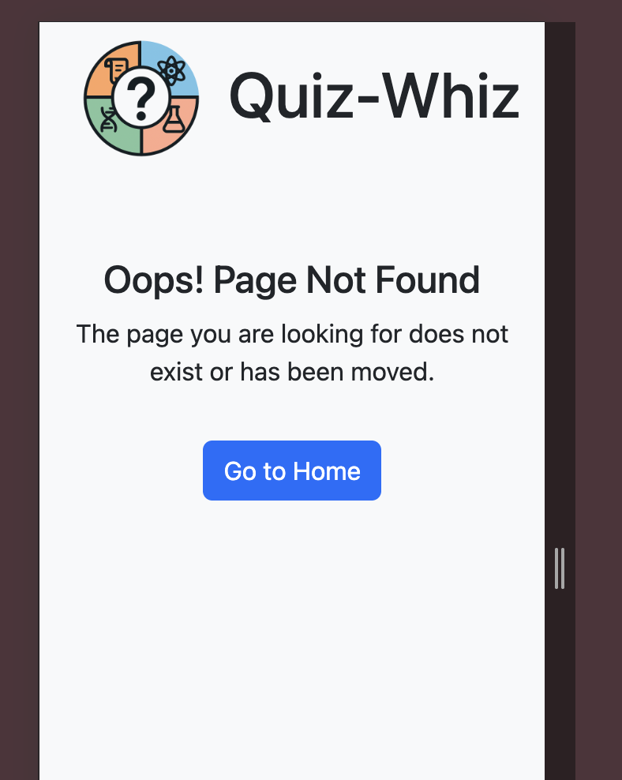

# Testing

> [!NOTE]
> Return back to the [README.md](README.md) file.

The following section outlines the testing, validation, and final results of the project. It details how each feature was verified for functionality, compatibility, and responsiveness.

## Code Validation

The following section presents the validation of all custom code files used in this project. Each file has been tested for syntax accuracy and standards compliance, with supporting screenshots provided as evidence.

### HTML

I have used the recommended [HTML W3C Validator](https://validator.w3.org) to validate all of my HTML files.

| Directory | File | URL | Screenshot | Notes |
| --- | --- | --- | --- | --- |
|  | [404.html](https://github.com/RadwanDuadu/Quiz-Whiz/blob/main/404.html) | [HTML Validator](https://validator.w3.org/nu/?doc=https://radwanduadu.github.io/Quiz-Whiz/404.html) |  | No errors detected |
|  | [index.html](https://github.com/RadwanDuadu/Quiz-Whiz/blob/main/index.html) | [HTML Validator](https://validator.w3.org/nu/?doc=https://radwanduadu.github.io/Quiz-Whiz/index.html) |  | No errors detected |

### CSS

I have used the recommended [CSS Jigsaw Validator](https://jigsaw.w3.org/css-validator) to validate all of my CSS files.

| Directory | File | URL | Screenshot | Notes |
| --- | --- | --- | --- | --- |
| assets | [style.css](https://github.com/RadwanDuadu/Quiz-Whiz/blob/main/assets/css/style.css) | [CSS Validator](https://jigsaw.w3.org/css-validator/validator?uri=https://radwanduadu.github.io/Quiz-Whiz) |  | No errors detected |

### JavaScript

I have used the recommended [JShint Validator](https://jshint.com) to validate all of my JS files.

| Directory | File | URL | Screenshot | Notes |
| --- | --- | --- | --- | --- |
| assets | [questions.js](https://github.com/RadwanDuadu/Quiz-Whiz/blob/main/assets/js/questions.js) | N/A |  | No errors detected |
| assets | [script.js](https://github.com/RadwanDuadu/Quiz-Whiz/blob/main/assets/js/script.js) | N/A |  | No errors detected |

## Responsiveness

I've tested my deployed project to check for responsiveness issues.

| Page | Mobile | Tablet | Desktop | Notes |
| --- | --- | --- | --- | --- |
| Home |  |  |  | Works as expected |
| 404 |  |  |  | Works as expected |

## Browser Compatibility

I've tested my deployed project on multiple browsers to check for compatibility issues.

| Page | Chrome | Firefox | Safari | Notes |
| --- | --- | --- | --- | --- |
| Home |  |  |  | Works as expected |
| 404 |  |  |  | Works as expected |

## Lighthouse Audit

I've tested my deployed project using the Lighthouse Audit tool to check for any major issues. Some warnings are outside of my control, and mobile results tend to be lower than desktop.

| Page | Mobile | Desktop |
| --- | --- | --- |
| Home |  |  |
| 404 |  |  |

## Defensive Programming

Defensive programming was manually tested with the below user acceptance testing:

| Page/Feature        | Expectation                                                             | Test                                                                      | Result                                                               | Screenshot                                                    |
| ------------------- | ----------------------------------------------------------------------- | ------------------------------------------------------------------------- | -------------------------------------------------------------------- | ------------------------------------------------------------- |
| **Quiz UI**         | Feature should allow the user to select a topic and answer questions.   | Clicked a topic button, answered all questions using available options.   | Quiz ran through 10 questions with answer tracking working.          |           |
|                     | Should disable submit button until an answer is selected.               | Tried clicking submit before selecting any answer.                        | Submit button remained disabled until an answer was chosen, or a feedback modal letting user know they must choose an answer appears.          |     |
|                     | Should prevent question counter from incrementing without an answer.    | Clicked submit without selecting an option.                               | Error modal appeared and question counter did not increment.         |   |
|                     | Buttons should be responsive and visually accessible.                   | Tested UI on mobile and desktop; used contrast checker.                   | Buttons resized correctly; contrast passed accessibility tests.      |  |
| **Topic Selection** | Only one topic button should be active at a time.                       | Clicked different topic buttons sequentially.                             | Only one button stayed highlighted; others were deselected.          |     |
| **Modal Feedback**  | Should show correct or incorrect feedback immediately after submission. | Submitted correct and incorrect answers.                                  | Modals showed corresponding feedback and continued to next question. |      |
| **Score Tracker**   | Should accurately track correct, incorrect, and total answers.          | Answered questions intentionally right/wrong.                             | Score updated in real-time with no discrepancies.                    |       |
| **Reset Button**    | Should reset the game state and UI elements.                            | Clicked "Play Again" and "Reset" buttons.                                 | Game restarted with scores and UI cleared.                           |          |
| **404 Page**        | Should display an error page for broken/invalid links.                  | Manually entered a non-existent route in the browser (e.g., `/quiz/xyz`). | Custom 404 page rendered correctly.                                  |            |

## User Story Testing

| Target | Expectation | Outcome | Screenshot |
| --- | --- | --- | --- |
| As a user | I would like to start the quiz immediately with Geography questions by default             | so that I can begin playing without needing to make a selection first. | |
| As a user | I would like to choose a different subject before starting the quiz                        | so that I can focus on a topic of my interest or study.                | |
| As a user | I would like to view the game rules before starting                                        | so that I understand how the quiz works.                               | |
| As a user | I would like to receive immediate feedback on my answers                                   | so that I can learn from my mistakes and improve.                      | |
| As a user | I would like to continue to the next question without refreshing or reloading              | so that I can keep playing smoothly.                                   ||
| As a user | I would like to see how many questions I got correct or incorrect                          | so that I can track my performance throughout the game.                | |
| As a user | I would like to reset the quiz at any time using a visible button                          | so that I can restart if I want a fresh attempt.                       |  |
| As a user | I would like the app to disable the submit button until I select an answer                 | so that I don’t accidentally submit without making a choice.           ||
| As a user | I would like to see feedback and scores in a visually clear and engaging format            | so that I can stay motivated and enjoy the experience.                 ||
| As a Visitor | I want to be redirected to a custom 404 page when I enter a non-existent URL so that I receive a relevant and personal message instead of a default error page. | A custom 404.html page exists and provides a personal message with navigation options. | |

## Bugs

### Fixed Bugs

I've used [GitHub Issues](https://www.github.com/RadwanDuadu/Quiz-Whiz/issues) to track and manage bugs and issues during the development stages of my project.

All previously closed/fixed bugs can be tracked [here](https://www.github.com/RadwanDuadu/Quiz-Whiz/issues?q=is%3Aissue+is%3Aclosed+label%3Abug).

### Unfixed Bugs

Any remaining open issues can be tracked [here](https://www.github.com/RadwanDuadu/Quiz-Whiz/issues).

